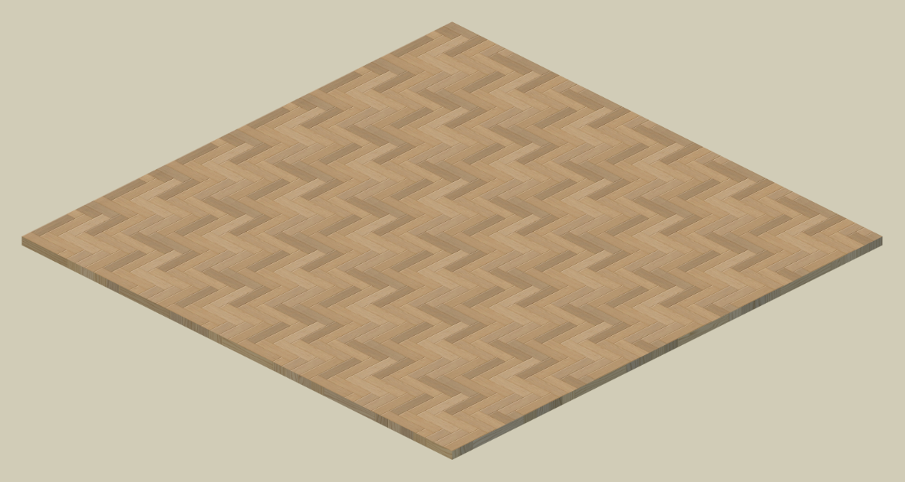
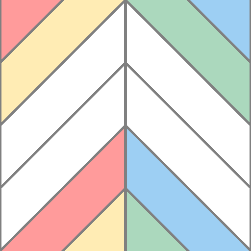
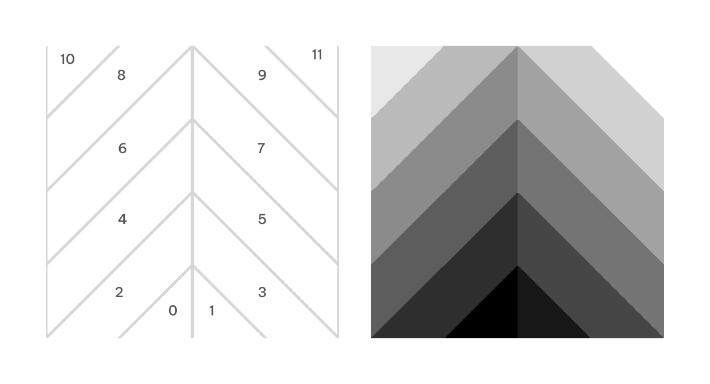
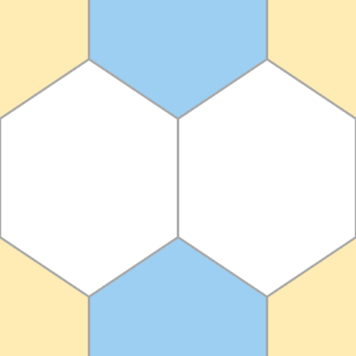
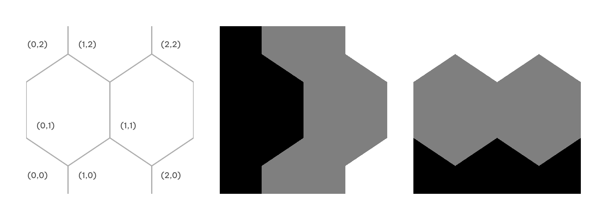
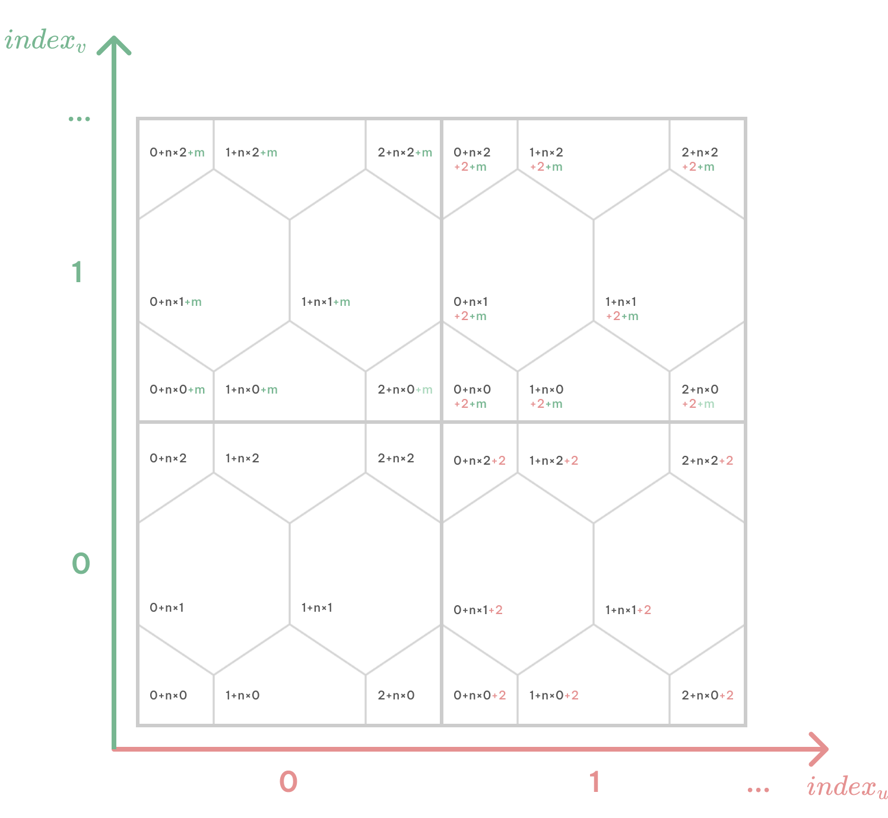
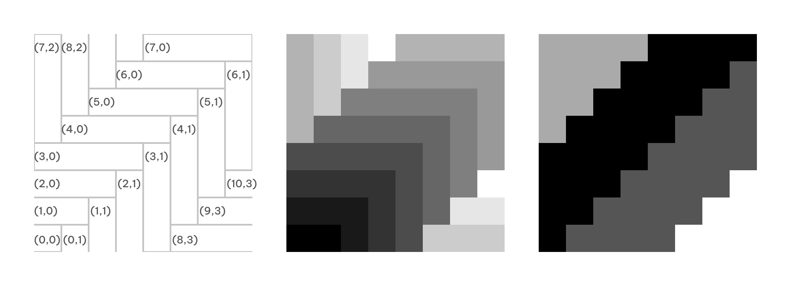
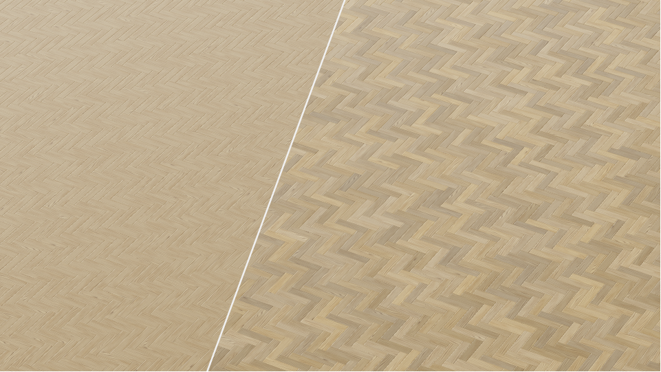

块状规则图案去除重复感方式


<!-- more -->

<blockquote class="twitter-tweet"><p lang="en" dir="ltr">Random tiling floor shader!<a href="https://twitter.com/hashtag/unity3d?src=hash&amp;ref_src=twsrc%5Etfw">#unity3d</a> <a href="https://t.co/ib7w09DdVF">pic.twitter.com/ib7w09DdVF</a></p>&mdash; Sorumi (@sorumi33) <a href="https://twitter.com/sorumi33/status/1543953380027969538?ref_src=twsrc%5Etfw">July 4, 2022</a></blockquote> <script async src="https://platform.twitter.com/widgets.js" charset="utf-8"></script>


对于地板地砖这种 Tiling 图案，图案较小时，大面积使用很容易出现重复感；图案较大时为了不重复又会需要太大的贴图尺寸。




怎样实现既有丰富变化并且又不使用高分辨率的贴图？这里提供一种解决这个问题思路，应该适用于大部分的规则图案。


#### 第一部分：为不同块生成随机数调整颜色

随机数可以有很多用处，例如改变颜色的明度和饱和度。

下面将用以下这 4 种图案作为示例，归纳出一种较通用的方式。


整体思路是为每一个 block 都生成一个 int 类型的 id 值，再根据 id 计算随机数。


##### 生成id

###### 图案 1

这个图案是最简单的正方形，一个 block 正好是一个 $$uv$$ 单元。将 tiling 后的 $$uv$$ 向下取整，得到 $$uv$$ 单元的 $$index_{u}$$ 和  $$index_{v}$$。

{:width="400"}

则 

$$id_{block} = index_{u} * m + index_{v} $$

参数 $$m$$ 只需要大于 tiling 的 $$u$$ 方向可能取的最大值，就可以保证每个 block 有不一样的 id 。


###### 图案 2

这个图案有 4 个 block 横跨了 $$v$$ 方向的 2 个 $$uv$$ 单元。

{:width="300"}

生成一张 index 贴图，用灰度表示一个 $$uv$$ 单元内的 block 分割。需要注意的是，横跨不同 $$uv$$ 单元的 block 需要给不同的 index。




用 $$max_{x}$$ 表示最大的 index 值，这里一共有 12 个 block，所以是 11。采样贴图得到的灰度值乘 $$max_{x}$$ 得到 $$index_{x}$$


```
int index_x = tex2d(_IndexMap).x * max_x;
```


根据图案规律，

$$id_{block} = index_{x} + index_{u} * m + index_{v} * 8 $$

这里的 8 表示横跨 $$v$$ 方向相邻两个 $$uv$$ 单元的 block 的 index 之差正好是 8，这样就能让两个不同 $$uv$$ 单元的同一个 block 拥有相同的 id。

同样地，参数 $$m$$ 只需要大于 tiling 的 $$u$$ 方向可能取的最大值。


###### 图案 3

这个图案不仅有 block （蓝色）横跨了$$v$$方向的 2 个 $$uv$$ 单元、还有 block （黄色）横跨了 4 个 $$uv$$ 单元。

{:width="300"}

单通道的 index 图无法适用这种情况，需要添加第二个通道。用 $$index_{x}$$ 表示列，$$index_{y}$$ 表示行。






根据图案的规律，

$$id_{block} = index_{x} + index_{y} * n + index_{u} * 2 + index_{v} * m $$

其中，

$$m=2n$$

其实我们的真正目的不是给每一个 block 都生成第一无二的 id 值，我们只需要让 id 值的重复度和图案本身不重合。所以对于 $$m$$ 和 $$n$$ 的取值并不是严格的，可以多多尝试。

总结下来以上几种图案的规律都是 $$index_{x}$$、$$index_{y}$$、$$index_{u}$$、$$index_{v}$$ 分别乘以对应的参数，再求和得到 id。在给 block 设置 index 时要注意，会横跨 $$uv$$ 单元的 block 的 index 之差必须相同。

###### 图案 4

{:width="300"}

最后这个图案可以自己尝试，因为同一个图案的 index 图生成方式和计算 id 的等式也不一定是唯一的。

这里我也给出我的 index 图和 id 公式。由于这个图案的特殊性，贴图只需要 8x8 的大小就可以了。



$$id_{block} = index_{x} + index_{y} * n + index_{u} * m_1 + index_{v} * m_2 $$

其中，

 $$m_1=8+3*n$$

 $$m_2=8+n$$


##### 计算随机数

每个 block 的 id 是 int 类型，为了计算随机数，首先将 id 除以最大的 id 值，映射到 $$[0,1]$$ 的范围中。

在 Shader 中计算随机数，比较常用的是  [The Book of Shaders]( https://thebookofshaders.com/10/ ) 中提到的方法：

```
float random (vec2 st)
{
    return fract(sin(dot(st.xy,vec2(12.9898,78.233)))*43758.5453123);
}
```

但是这个函数有用到指令数较高的三角函数，出于性能考虑，可以仿照这个形式，自己写伪随机数的生成，用2次 `fract()` 和一些 magic number 来避免三角函数。由于 GPU 上 `float` 和 `float4` 的消耗是相同，可以一次计算 4 个随机数。

得到的效果如图：


这里我用 2 个生成的随机数进行饱和度和明度上的调整，下图可以看到前后的效果对比。




##### 其他需要注意的地方

- 所有贴图都是在 Substance Designer 2020 中制作的，像 index 贴图导出时，可能会出现类似噪点，颜色不均匀的问题，这里用了比较绕的方式：用 **2D View** 中菜单栏的 **Copy view into the clipboard** 命令，在粘贴到 Photoshop 中。是了很多方法只有这个能保证导出图片的颜色没有变化，如果有更好的方法请告诉我！

- 游戏引擎中贴图导入选项要注意：取消生成 Mipmap，采样方式改为点采样（Point Filter）。


---

下一篇将说明用方向图和随机数采样细节贴图。